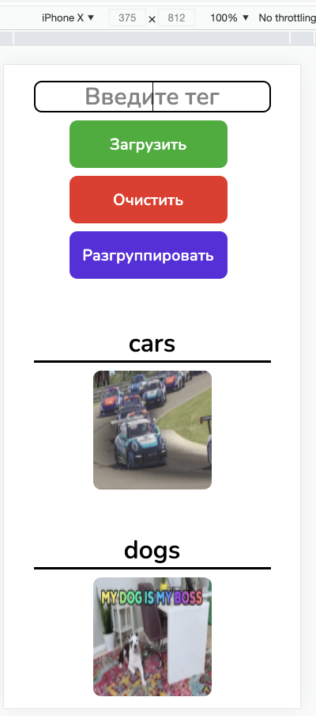

# Gif search website

### Desktop version:

This website created for desktop, mobile and tablet. You can see mobile and tablet down below

## INSTALLATION:

### `npm install`

## RUN SERVER

### `npm start`

You can use my API address: API_KEY = `JwZEALrQR5Tawm640pG7W74oPJxjbXN4`

You need to change the file `src/store/API_KEY.ts` by adding API_KEY i mentioned before

Чтобы воспользоваться моим API необходимо заменить в файле `src/store/API_KEY.ts` API_KEY, на тот, что я указал выше.

## DEPENDENCIES

    "react": "^17.0.2",
    "react-dom": "^17.0.2",
    "react-redux": "^7.2.4",
    "redux": "^4.1.0",
    "redux-saga": "^1.1.3",
    "uuid": "^3.4.0"

### I've used this API: https://api.giphy.com

### Mobile version:

### Tablet version:

